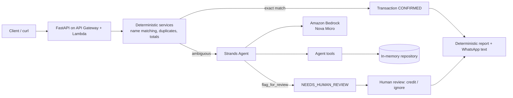

# ChangaSmart

An AI-assisted contribution reconciliation assistant for temporary Kenyan
fundraising projects -- funerals, medical fundraisers, weddings, school
fees, and Harambee sessions.

> This is a hackathon prototype. It is **not** an M-PESA banking or
> payment service, and has no direct connection to M-PESA. It reconciles
> *structured transaction data* that a human or a future mobile app has
> already extracted from M-PESA SMS confirmations.

## The problem

Community fundraisers in Kenya are usually run by one person (the "harambee
secretary") manually cross-checking a WhatsApp group's pledges against a
stream of M-PESA confirmation SMSs. This breaks down fast:

* Names on M-PESA don't match names on the contributor list ("JANE M
  WANJIKU" vs "Jane Wanjiku").
* Someone pays *on behalf of* someone else (Anne pays Jane's pledge).
* Duplicate SMS forwards get double-counted.
* Producing a clean "who has paid" update for the WhatsApp group takes
  real manual effort, repeatedly, over the life of the fundraiser.

ChangaSmart automates the reconciliation *reasoning* while keeping a
human in the loop for anything genuinely ambiguous, and keeps every
financial calculation in deterministic code -- never in the LLM.

## Main Contribution vs. Harambee

A **Project** (e.g. "Mary's Medical Fund") contains one or more
**Collections**. A Collection is either:

* **MAIN** -- the project's single, ongoing contribution list.
* **HARAMBEE** -- a short, usually one-day fundraising drive inside the
  project, with its own target and its own set of transactions. A project
  can have many Harambee sessions over its lifetime, each closable
  independently.

```
Project: "Mary's Medical Fund"
├── Main Contribution        (Collection, type=MAIN)
├── Harambee #1               (Collection, type=HARAMBEE)
├── Harambee #2               (Collection, type=HARAMBEE)
└── Harambee #3               (Collection, type=HARAMBEE)
```

Both share the exact same `Collection` model and the exact same
reconciliation/reporting/WhatsApp-text infrastructure -- there is no
separate code path for "harambee mode."

## Architecture



Request flow for the interesting case (`POST /collections/{id}/reconcile`):

```
HTTP request
  -> app/main.py            (thin route handler)
  -> app/agent.py            reconcile_transaction()
       -> app/services/reconciliation.py   deterministic exact-match check
            (matched -> done, no LLM call)
            (ambiguous -> ...)
       -> Strands Agent (Bedrock, Nova Micro)
            -> app/tools/*    (get_project, get_contributors, get_transactions,
                                find_contributor_candidates, record_contribution,
                                flag_for_review, generate_collection_report)
            -> app/repositories/memory.py   (storage)
  -> structured ReconciliationDecision
```

### Why the deterministic layer goes first

Exact or near-exact name matches (including different capitalization/
punctuation) are resolved in plain Python via
`app/services/reconciliation.py` and **never reach the LLM at all** -- this
keeps Bedrock calls (and cost) limited to genuinely ambiguous cases, and
guarantees financial matching for the common case can't be affected by
model variance.

### How the Strands agent works

`app/agent.py` builds a fresh `strands.Agent` per ambiguous transaction,
wired to:

* **Model**: `strands.models.BedrockModel`, region and model id from
  `app/config.py` (env vars `AWS_REGION` / `BEDROCK_MODEL_ID`, default
  `amazon.nova-micro-v1:0` -- a low-cost model appropriate for this
  reasoning + tool-calling workload).
* **System prompt**: `app/prompts.py` -- fifteen explicit rules (never
  invent data, never touch amounts, never silently rename the sender,
  flag ambiguity instead of guessing, treat human review as final, etc).
* **Tools**: `app/tools/*.py` -- the agent's only way to read data or
  change transaction state. Scoring (name similarity, amount matching) is
  always computed in `app/services/reconciliation.py`; the agent reasons
  over that output, it does not invent scores.
* **Structured output**: the agent call passes
  `structured_output_model=ReconciliationDecision`, so the response is a
  validated Pydantic object (`decision`, `paid_by`, `suggested_contributor_id`,
  `reason`, `confidence`) -- not free text to be parsed.

The agent is explicitly told **not** to calculate totals or balances --
`generate_collection_report` (deterministic Python) is the only source of
truth for money.

### Where Bedrock fits

Bedrock is only invoked for the ambiguous branch. The deterministic branch
and all reporting/WhatsApp-text generation run with zero AWS calls, so the
whole system (except ambiguous-case reasoning) works with no AWS
credentials at all.

### paid_by vs. credited_to

The single most important invariant in this system: **the M-PESA sender
name is never overwritten.** A `Transaction` always keeps `sender_name`
(who actually paid) separate from `matched_contributor_id` (who the money
is credited to). If Anne Otieno pays KSh 3,000 that turns out to be Jane
Wanjiku's pledge, the record permanently shows both -- `paid_by = "Anne
Otieno"`, credited to Jane's contributor id -- never silently collapsed
into one name.

## Local development

```bash
cd backend
python3 -m venv ../.venv
source ../.venv/bin/activate
pip install -r requirements.txt
cp ../.env.example ../.env
uvicorn app.main:app --reload
```

API docs at http://localhost:8000/docs.

### Seed realistic sample data

With the server running:

```bash
python sample-data/seed.py
```

This creates "Mary's Medical Fund" with a Main Contribution and three
Harambee sessions, covering all nine reconciliation scenarios described in
`sample-data/mary_medical_fund.json` (exact match, formatting differences,
amount-only match, name mismatch, payment-on-behalf, duplicate code,
unknown sender, Harambee contributions, multiple Harambee sessions). It
prints each collection's id and a ready-to-run `curl` command for
`/reconcile`.

## AWS configuration

Set in `.env` (see `.env.example`):

| Variable | Default | Purpose |
|---|---|---|
| `AWS_REGION` | `us-east-1` | Bedrock region (auto-set by Lambda in prod) |
| `BEDROCK_MODEL_ID` | `amazon.nova-micro-v1:0` | Model the agent calls |

No credentials are hard-coded anywhere -- boto3's standard credential
resolution chain is used (`aws configure`, environment variables, or an
IAM role in Lambda). You need:

1. AWS credentials with `bedrock:InvokeModel` / `InvokeModelWithResponseStream`
   permission (see `infrastructure/aws/template.yaml` for the exact scoped
   policy used in the Lambda deployment).
2. Model access enabled for `amazon.nova-micro-v1:0` in the Bedrock
   console's "Model access" page, in your target region.

Without both of these, deterministic reconciliation (exact matches,
duplicates, reports, WhatsApp text) still works fully -- only the
ambiguous-case agent path needs Bedrock, and it fails per-transaction with
a clear error rather than crashing the request or silently mismatching.

## Running tests

```bash
cd backend
pytest
```

24 tests, all offline (no AWS calls) -- see `backend/README.md` for why.

## AWS deployment

```bash
cd infrastructure/aws
sam build
sam deploy
```

See `infrastructure/aws/README.md` for details on what gets created (one
Lambda, one API Gateway HTTP API, one scoped Bedrock IAM policy, one log
group -- deliberately no DynamoDB, no VPC).

## Current limitations

* **In-memory storage only.** State lives in the Python process; it does
  not survive a restart, and in Lambda it does not survive a cold start or
  persist across concurrent invocations. Fine for a demo, not for
  production.
* **No authentication.** Anyone who can reach the API can call any
  endpoint.
* **No real SMS/WhatsApp/M-PESA integration.** All transaction input is
  structured JSON (see `TransactionCandidate` in `app/models.py`) -- the
  scaffold assumes something upstream has already parsed the SMS.
* **Single-tenant.** No user accounts or multi-project isolation beyond
  project ids.

## Future architecture

The eventual mobile app does **local** SMS parsing and only sends
structured data to the backend -- it never uploads a raw SMS inbox to the
LLM:

```
Android SMS
  -> local parsing (on-device)
  -> structured transaction (mpesa_code, sender_name, amount, timestamp, raw_message)
  -> POST /collections/{id}/transactions
  -> reconciliation agent (this repo)
```

Planned, not built yet:

* DynamoDB (or similar) replacing the in-memory repository -- the
  `app/repositories/base.py` interfaces exist specifically so this swap
  doesn't touch the agent, tools, or routes.
* Flutter mobile app (SMS capture + a "Copy" button over the WhatsApp text
  endpoints).
* WhatsApp Business API integration (currently: deterministic text
  generation only, meant to be copy/pasted).
* Authentication and per-project access control.
